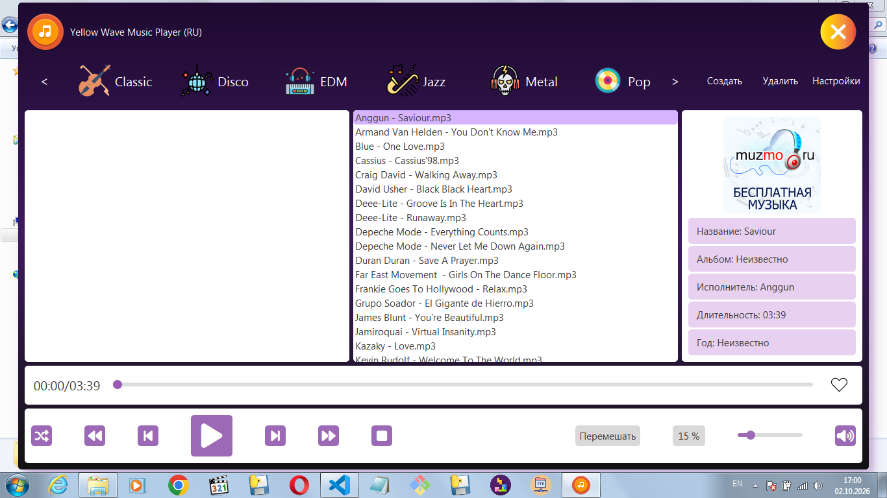
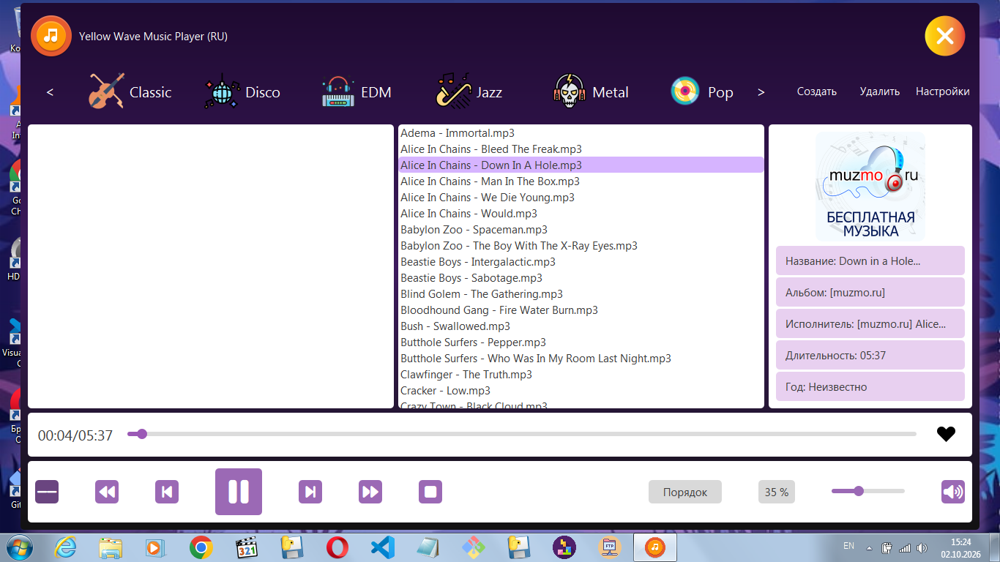
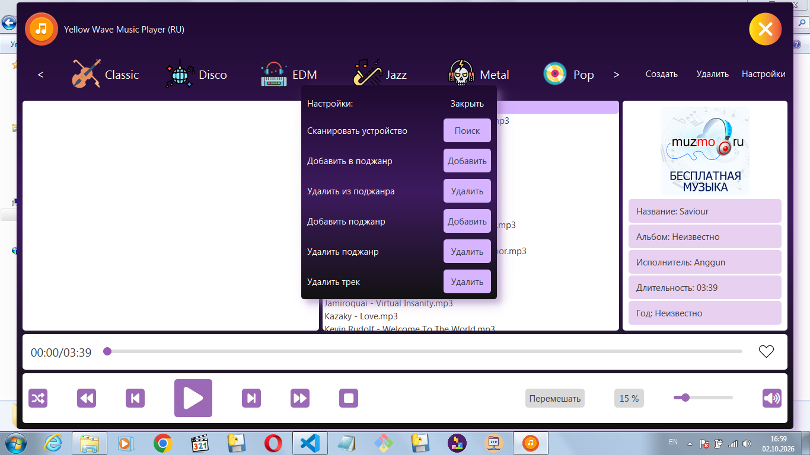

# Yellow Wave Music Player 🎵

Музыкальный плеер для Windows с тёмной темой в стиле Material Design. 
Написан на **PyQt5**, метаданные через **Mutagen**, воспроизведение через **Pygame**.



## ✨ Возможности

- 🎨 **Тёмная тема** в стиле Material Design с тенями и скруглёнными углами
- 📁 **Плейлисты и поджанры** — создание, удаление, вложенные папки
- ❤️ **Избранное** — копирование трека в отдельную папку одним кликом
- 🎼 **Метаданные** — название, исполнитель, альбом, год, обложка (ID3, Vorbis, MP4)
- 🎧 **Форматы** — MP3, FLAC, OGG, WAV, M4A
- ⌨️ **Горячие клавиши** — управление без мышки
- 💾 **Сохранение настроек** — громкость, режим, последняя папка
- 🔀 **Режимы воспроизведения** — Порядок, Повтор, Повтор трека, Перемешать
- ✏️ **Переименование треков** — прямо из плеера (F2)
- 🚀 **Портативная сборка** — `.exe` работает без Python




## 📦 Установка

### Вариант 1 — Готовый `.exe` (рекомендуется)

1. Скачай архив со страницы [**Releases**](../../releases/latest)
2. Распакуй в любую папку
3. Запусти `YellowWave.exe`

**Требования:** Windows 7 и выше. Python **не нужен**.

### Вариант 2 — Из исходного кода

```bash
git clone https://github.com/YaroslavIshkov/Yellow-Wave.git
cd Yellow-Wave
pip install -r requirements.txt
python main.py
```

**Требования:** Python 3.8+

## ⌨️ Горячие клавиши

| Клавиша | Действие |
|---------|----------|
| **Space** | Play / Pause |
| **S** | Stop (сброс на начало) |
| **← / →** | Перемотка ±5 секунд |
| **Ctrl + ← / →** | Предыдущий / следующий трек |
| **↑ / ↓** | Громкость ±5% |
| **M** | Mute |
| **L** | Добавить / убрать из Избранного |
| **R** | Сменить режим воспроизведения |
| **F2** | Переименовать текущий трек |
| **Ctrl + O** | Открыть сканирование папки Music |
| **Ctrl + Q** | Закрыть приложение |

## 🎵 Управление плейлистами

1. **Создать плейлист:** кнопка «Создать» в верхней панели
2. **Добавить поджанр:** Настройки → «Добавить поджанр»
3. **Добавить трек в поджанр:** выдели трек → Настройки → «Добавить в поджанр»
4. **Добавить в Избранное:** клавиша **L** или клик по сердечку

## 📁 Структура проекта

```
Yellow-Wave/
├── core/
│   ├── app/           # Application — центральный контроллер
│   ├── json/          # JsonManager — работа с JSON
│   ├── logger/        # Настройка логирования
│   ├── settings/      # SettingsCore — управление плейлистами
│   ├── select/        # SelectDialog — выбор папки
│   ├── init/          # LoadDialog — сканирование Music
│   ├── screen/        # Screen — работа с монитором
│   ├── messages/      # MessageBox — уведомления
│   ├── tmp/           # TempManager — кэш обложек
│   └── ui/
│       ├── main/      # Frontend — сборка окна
│       ├── style/     # styles.py — все QSS-стили
│       └── widgets/   # Кнопки, слайдеры, метки, диалоги
├── fonts/             # Font Awesome 6 Free
├── icons/             # Иконки интерфейса
├── Playlists/         # Пользовательские плейлисты (создаётся автоматически)
├── main.py            # Точка входа
├── requirements.txt   # Зависимости
└── build.bat          # Сборка .exe (Windows)
```

## 🔧 Сборка `.exe`

Если хочешь собрать портативную версию сам:

```bash
# Установи PyInstaller
pip install pyinstaller

# Запусти батник (Windows)
build.bat
```

Готовое приложение появится в `dist/YellowWave/`. Папку целиком можно переносить куда угодно.

## 📚 Зависимости

| Библиотека | Версия | Назначение |
|-----------|--------|-----------|
| PyQt5 | 5.15.11+ | GUI |
| Mutagen | 1.47.0+ | Чтение метаданных |
| Pygame | 2.6.1+ | Воспроизведение аудио |
| Pillow | — | Генерация иконок |

Установка одной командой:

```bash
pip install -r requirements.txt
```

## 📄 Лицензия

Проект распространяется под лицензией **GPL-3.0-or-later** — из-за использования PyQt5 под GPLv3.

Это значит: **используй свободно, но если форкаешь — открывай исходники.**

## 👤 Автор

**Yaroslav Ishkov** — [@YaroslavIshkov](https://github.com/YaroslavIshkov)

Если проект пригодился — поставь ⭐ на GitHub. Это мотивирует делать больше.

---

*Yellow Wave Music Player © 2026 Yaroslav Ishkov*